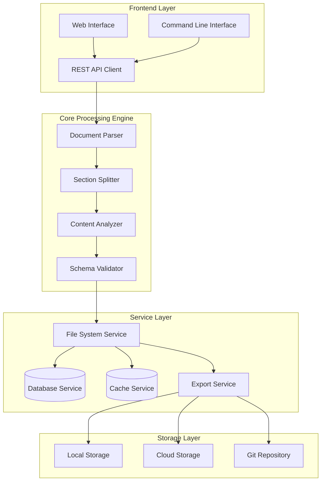

# SpecSplit

> A powerful tool for splitting and managing specification documents into manageable sections

---

## Table of Contents

- [Features](#features)
- [System Architecture](#system-architecture)
- [Tech Stack](#tech-stack)
- [Getting Started](#getting-started)
- [Configuration](#configuration)
- [Stats](#stats)
- [Contributing](#contributing)
- [License](#license)

---

## Features

- **Document Parsing** - Intelligent parsing of various document formats (Markdown, JSON, YAML, XML)
- **Smart Section Detection** - Automatically identifies and separates document sections based on headers and logical blocks
- **Batch Processing** - Process multiple specification files simultaneously
- **Custom Output Formats** - Export split documents in multiple formats (HTML, PDF, Markdown, JSON)
- **Version Control Integration** - Seamless integration with Git for tracking document changes
- **Template System** - Create and use reusable templates for consistent document structure
- **Search & Filter** - Quick search across all split documents with advanced filtering options
- **Collaboration Tools** - Share and collaborate on specification documents with team members
- **Export Options** - Export individual sections or entire document trees
- **CLI Support** - Powerful command-line interface for automation workflows

---

## System Architecture



---

## Tech Stack

### Frontend
- **Framework**: React 18 / Vue 3 / Angular 15
- **Styling**: Tailwind CSS / SCSS / Styled Components
- **State Management**: Redux Toolkit / Pinia / NgRx
- **Build Tool**: Vite / Webpack

### Backend
- **Runtime**: Node.js 18+ / Python 3.10+ / Go 1.20+
- **Framework**: Express.js / FastAPI / Gin
- **Database**: PostgreSQL / MongoDB / SQLite
- **Cache**: Redis / Memcached

### DevOps
- **Container**: Docker / Kubernetes
- **CI/CD**: GitHub Actions / GitLab CI / Jenkins
- **Cloud**: AWS / GCP / Azure

### Tools
- **Version Control**: Git
- **Testing**: Jest / PyTest / Go Testing
- **Linting**: ESLint / Pylint / golangci-lint

---

## Getting Started

### Prerequisites

- Node.js 18 or higher
- Python 3.10+ (if using Python backend)
- Git
- Docker (optional, for containerized setup)

### Installation

```bash
# Clone the repository
git clone https://github.com/girishlade111/SpecSplit.git
cd SpecSplit

# Install dependencies
npm install   # For Node.js
# or
pip install -r requirements.txt   # For Python

# Configure environment
cp .env.example .env

# Start the application
npm run dev   # Development mode
# or
npm start    # Production mode
```

### Quick Start

1. **Create a new specification document**
   ```bash
   specsplit init my-spec
   ```

2. **Import an existing document**
   ```bash
   specsplit import document.md
   ```

3. **Split the document into sections**
   ```bash
   specsplit split --output ./output
   ```

4. **Export results**
   ```bash
   specsplit export --format html
   ```

---

## Configuration

### Environment Variables

| Variable | Description | Default |
|----------|-------------|---------|
| `PORT` | Server port | `3000` |
| `NODE_ENV` | Environment mode | `development` |
| `DATABASE_URL` | Database connection string | `sqlite://./data.db` |
| `CACHE_ENABLED` | Enable caching | `true` |
| `MAX_FILE_SIZE` | Maximum file upload size (MB) | `50` |
| `OUTPUT_DIR` | Default output directory | `./output` |

### Configuration File

Create `specsplit.config.json` in your project root:

```json
{
  "parser": {
    "autoDetect": true,
    "supportedFormats": [".md", ".json", ".yaml", ".xml"],
    "encoding": "utf-8"
  },
  "splitter": {
    "strategy": "semantic",
    "minSectionLength": 100,
    "maxSectionLength": 10000
  },
  "export": {
    "defaultFormat": "markdown",
    "includeMetadata": true,
    "generateIndex": true
  },
  "output": {
    "directory": "./output",
    "namingPattern": "{section}-{index}"
  }
}
```

### CLI Options

```bash
specsplit [command] [options]

Commands:
  init          Initialize a new project
  import        Import a document
  split         Split document into sections
  export        Export split documents
  serve         Start the web server
  config        Manage configuration

Options:
  --verbose     Enable verbose logging
  --config      Specify config file path
  --output      Set output directory
  --format      Set export format
```

---

## Stats

| Metric | Value |
|--------|-------|
| **Version** | 1.0.0 |
| **Last Updated** | May 2026 |
| **Contributors** | 1+ |
| **Stars** | - |
| **Forks** | - |
| **License** | MIT |

---

## Contributing

1. Fork the repository
2. Create a feature branch (`git checkout -b feature/amazing-feature`)
3. Commit your changes (`git commit -m 'Add amazing feature'`)
4. Push to the branch (`git push origin feature/amazing-feature`)
5. Open a Pull Request

---

## License

MIT License - see [LICENSE](LICENSE) for details.

---

## Support

- 📖 [Documentation](https://github.com/girishlade111/SpecSplit/wiki)
- 🐛 [Issue Tracker](https://github.com/girishlade111/SpecSplit/issues)
- 💬 [Discussions](https://github.com/girishlade111/SpecSplit/discussions)